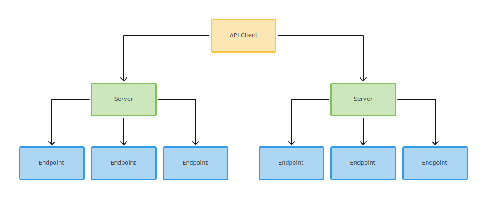
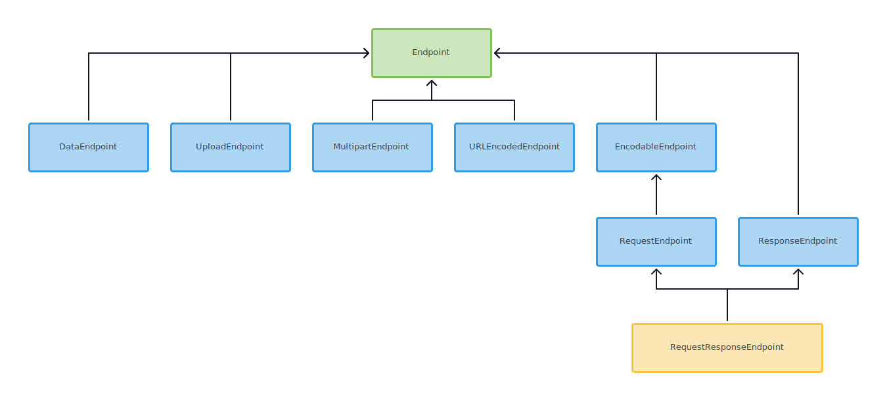

# FTAPIKit


Declarative and generic REST API framework using Codable.
With the standard implementation using URLSesssion and JSON encoder/decoder.
Easily extensible for your asynchronous framework or networking stack.

## Installation

When using Swift package manager install using Xcode 11+
or add following line to your dependencies:

```swift
.package(url: "https://github.com/futuredapp/FTAPIKit.git", from: "1.2.3")
```

When using CocoaPods add following line to your `Podfile`:

```ruby
pod 'FTAPIKit', '~> 1.2'
```

## Features

The main feature of this library is to provide documentation-like API
for defining web services. This is achieved using declarative
and protocol-oriented programming in Swift.

The framework provides two core protocols reflecting the physical infrastructure:

- `Server` protocol defining single web service.
- `Endpoint` protocol defining access points for resources.

Combining instances of type conforming to `Server` and `Endpoint` we can build request.
`URLServer` has convenience method for calling endpoints using `URLSession`.
If some advanced features are required then we recommend implementing API client.
This client should encapsulate logic which is not provided by this framework
(like signing authorized endpoints or conforming to `URLSessionDelegate`).



This package contains predefined `Endpoint` protocols.
Use cases like multipart upload, automatic encoding/decoding
are separated in various protocols for convenience.

- `Endpoint` protocol has empty body. Typically used in `GET` endpoints.
- `DataEndpoint` sends provided data in body.
- `UploadEndpoint` uploads file using `InputStream`.
- `MultipartEndpoint` combines body parts into `InputStream` and sends them to server.
  Body parts are represented by `MultipartBodyPart` struct and provided to the endpoint
  in an array.
- `RequestEndpoint` has encodable request which is encoded using encoding
  of the `Server` instance.



## Usage

### Defining web service (server)

Firstly we need to define our server. Structs are preferred but not required:

```swift
struct HTTPBinServer: URLServer {
    let baseUri = URL(string: "http://httpbin.org/")!
    let urlSession = URLSession(configuration: .default)
}
```

If we want to use custom formatting we just need to add our encoding/decoding configuration:

```swift
struct HTTPBinServer: URLServer {
    ...

    let decoding: Decoding = JSONDecoding { decoder in
        decoder.keyDecodingStrategy = .convertFromSnakeCase
    }
    let encoding: Encoding = JSONEncoding { encoder in
        encoder.keyEncodingStrategy = .convertToSnakeCase
    }
}
```

If we need to create specific request, add some headers, usually to provide
authorization we can override default request building mechanism.

```swift
struct HTTPBinServer: URLServer {
    ...
    func buildRequest(endpoint: Endpoint) throws -> URLRequest {
        var request = try buildStandardRequest(endpoint: endpoint)
        request.addValue("MyApp/1.0.0", forHTTPHeaderField: "User-Agent")
        return request
    }
}
```

### Defining endpoints

Most basic `GET` endpoint can be implemented using `Endpoint` protocol,
all default propertires are inferred.

```swift
struct GetEndpoint: Endpoint {
    let path = "get"
}
```

Let's take more complicated example like updating some model.
We need to supply encodable request and decodable response.

```swift
struct UpdateUserEndpoint: RequestResponseEndpoint {
    typealias Response = User

    let request: User
    let path = "user"
}
```

### Executing the request

When we have server and enpoint defined we can call the web service:

```swift
let server = HTTPBinServer()
let endpoint = UpdateUserEndpoint(request: user)
server.call(response: endpoint) { result in
    switch result {
    case .success(let updatedUser):
        ...
    case .failure(let error):
        ...
    }
}
```

## Contributors

Current maintainer and main contributor is [Matěj Kašpar Jirásek](https://github.com/mkj-is), <matej.jirasek@futured.app>.

We want to thank other contributors, namely:

- [Mikoláš Stuchlík](https://github.com/mikolasstuchlik)
- [Radek Doležal](https://github.com/eRDe33)
- [Adam Bezák](https://github.com/bezoadam)
- [Patrik Potoček](https://github.com/Patrez)

## License

FTAPIKit is available under the MIT license. See the [LICENSE file](LICENSE) for more information.
