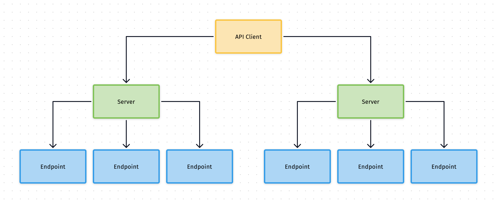
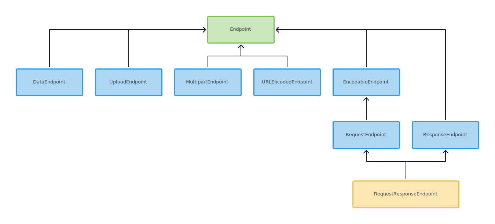

# FTAPIKit


Declarative async/await REST API framework using Swift Concurrency and Codable.
With standard implementation using URLSession and JSON encoder/decoder.
Built for Swift 6.1+ with full concurrency safety.

## Requirements

- Swift 6.1+
- iOS 15+, macOS 12+, tvOS 15+, watchOS 8+

## Installation

Add the following line to your Swift Package Manager dependencies:

```swift
.package(url: "https://github.com/futuredapp/FTAPIKit.git", from: "2.0.0")
```

## Features

The main feature of this library is to provide documentation-like API
for defining web services. This is achieved using declarative
and protocol-oriented programming in Swift.

The framework provides two core protocols reflecting the physical infrastructure:

- `URLServer` protocol defining single web service with built-in URLSession support.
- `Endpoint` protocol defining access points for resources.

Combining instances of type conforming to `URLServer` and `Endpoint` we can build request.
`URLServer` has convenience methods for calling endpoints using `URLSession`.



This package contains predefined `Endpoint` protocols.
Use cases like multipart upload, automatic encoding/decoding
are separated in various protocols for convenience.

- `Endpoint` protocol has empty body. Typically used in `GET` endpoints.
- `DataEndpoint` sends provided data in body.
- `UploadEndpoint` uploads file from a URL using `URLSession` upload task.
- `MultipartEndpoint` combines body parts into `InputStream` and sends them to server.
  Body parts are represented by `MultipartBodyPart` struct and provided to the endpoint
  in an array.
- `URLEncodedEndpoint` sends body in URL query format.
- `RequestEndpoint` has encodable request which is encoded using encoding
  of the `URLServer` instance.



## Usage

### Defining web service (server)

Firstly we need to define our server. Structs are preferred but not required:

```swift
struct HTTPBinServer: URLServer {
    let baseUri = URL(string: "http://httpbin.org/")!
    let urlSession = URLSession(configuration: .default)
}
```

If we want to use custom formatting we just need to add our encoding/decoding configuration:

```swift
struct HTTPBinServer: URLServer {
    ...

    let decoding: Decoding = JSONDecoding { decoder in
        decoder.keyDecodingStrategy = .convertFromSnakeCase
    }
    let encoding: Encoding = JSONEncoding { encoder in
        encoder.keyEncodingStrategy = .convertToSnakeCase
    }
}
```

If we need to create specific request, add some headers, usually to provide
authorization we can override default request building mechanism.

```swift
struct HTTPBinServer: URLServer {
    ...
    func buildRequest(endpoint: Endpoint) async throws -> URLRequest {
        var request = try buildStandardRequest(endpoint: endpoint)
        request.addValue("MyApp/1.0.0", forHTTPHeaderField: "User-Agent")
        return request
    }
}
```

### Defining endpoints

Most basic `GET` endpoint can be implemented using `Endpoint` protocol,
all default properties are inferred.

```swift
struct GetEndpoint: Endpoint {
    let path = "get"
}
```

Let's take more complicated example like updating some model.
We need to supply encodable request and decodable response.

```swift
struct UpdateUserEndpoint: RequestResponseEndpoint {
    typealias Response = User

    let request: User
    let path = "user"
}
```

### Executing the request

When we have server and endpoint defined we can call the web service using async/await:

```swift
let server = HTTPBinServer()
let endpoint = UpdateUserEndpoint(request: user)

let updatedUser = try await server.call(response: endpoint)
```

### Async buildRequest

One of the key features in FTAPIKit 2.0 is the ability to use async operations in `buildRequest`. This enables use cases like:

- **Token Refresh**: Await token refresh before building the request
- **Dynamic Configuration**: Fetch configuration or headers asynchronously
- **Rate Limiting**: Implement delays or throttling

Example with async token refresh:

```swift
struct MyServer: URLServer {
    let baseUri = URL(string: "https://api.example.com")!
    let tokenManager: TokenManager

    func buildRequest(endpoint: Endpoint) async throws -> URLRequest {
        // Refresh token if needed
        await tokenManager.refreshIfNeeded()

        var request = try buildStandardRequest(endpoint: endpoint)
        request.addValue("Bearer \(tokenManager.token)", forHTTPHeaderField: "Authorization")
        return request
    }
}
```

### Request Configuration at Call Site

For scenarios where you need to configure requests at the call site (rather than in the server),
use the `RequestConfiguring` protocol. This is useful for:

- Adding authorization headers in an API service layer
- Per-request configuration that varies by context
- Keeping server implementations simple and reusable

```swift
struct AuthorizedConfiguration: RequestConfiguring {
    let authService: AuthService

    func configure(_ request: inout URLRequest) async throws {
        let token = try await authService.getValidAccessToken()
        request.setValue("Bearer \(token)", forHTTPHeaderField: "Authorization")
    }
}

// Usage - configuration is optional with nil default
let server = HTTPBinServer()
let authConfig = AuthorizedConfiguration(authService: authService)

// Public endpoint - no configuration needed
let publicData = try await server.call(response: publicEndpoint)

// Protected endpoint - with configuration
let protectedData = try await server.call(response: protectedEndpoint, configuring: authConfig)
```

### Network Observers

Monitor request lifecycle with the `NetworkObserver` protocol:

```swift
final class LoggingObserver: NetworkObserver {
    func willSendRequest(_ request: URLRequest) -> String {
        let id = UUID().uuidString
        print("[\(id)] Sending: \(request.url!)")
        return id
    }

    func didReceiveResponse(for request: URLRequest, response: URLResponse?, data: Data?, context: String) {
        print("[\(context)] Received response")
    }

    func didFail(request: URLRequest, error: Error, context: String) {
        print("[\(context)] Failed: \(error)")
    }
}

struct MyServer: URLServer {
    let baseUri = URL(string: "https://api.example.com")!
    let networkObservers: [any NetworkObserver] = [LoggingObserver()]
}
```

### Error Handling

The framework uses the `APIError` protocol for error handling. The default implementation `APIError.Standard` covers common cases:

```swift
do {
    let response = try await server.call(response: endpoint)
} catch let error as APIError.Standard {
    switch error {
    case .connection(let urlError):
        // Network connectivity issue
    case .client(let statusCode, _, _):
        // 4xx client error
    case .server(let statusCode, _, _):
        // 5xx server error
    case .decoding(let decodingError):
        // Response parsing failed
    default:
        break
    }
}
```

For custom error parsing, define a type conforming to `APIError` and set it as the `ErrorType` on your server:

```swift
struct MyServer: URLServer {
    typealias ErrorType = MyCustomError
    let baseUri = URL(string: "https://api.example.com")!
}
```

## Contributors

Current maintainer and main contributor is [Matěj Kašpar Jirásek](https://github.com/mkj-is), <matej.jirasek@futured.app>.

We want to thank other contributors, namely:

- [Mikoláš Stuchlík](https://github.com/mikolasstuchlik)
- [Radek Doležal](https://github.com/eRDe33)
- [Adam Bezák](https://github.com/bezoadam)
- [Patrik Potoček](https://github.com/Patrez)

## License

FTAPIKit is available under the MIT license. See the [LICENSE file](LICENSE) for more information.
